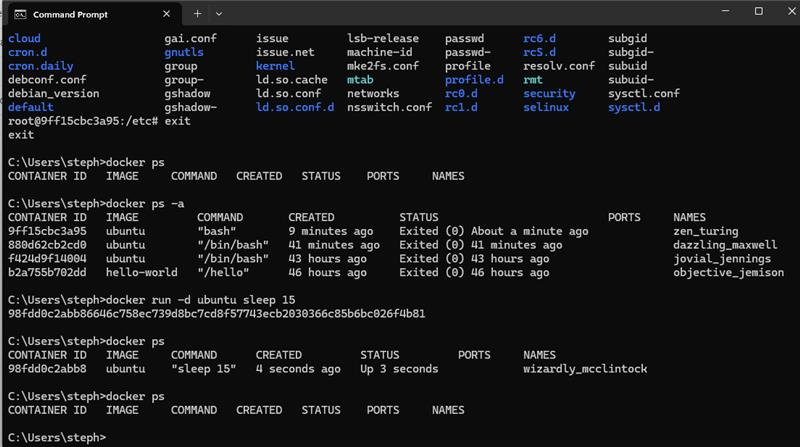
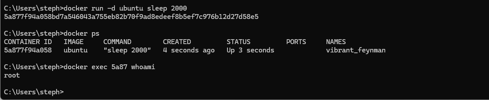
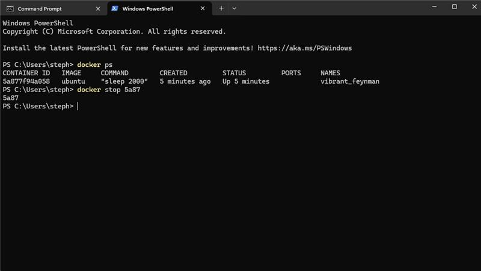

# Containerisation: 
- Software development architecture that bundles an application's code with just its dependencies and the operating system to create a container
- becomes a single, light weight executable
- each container is independent of one another, but are loosely linked within a network
- each container can be scaled independently  
- containers share the machine's operating system kernel 

# Docker
- automates the deployment of apps within lightweight containers
- open source
- uses Linux kernel

# Docker commands:
`docker ps` - will show all running containers
`docker ps -a` - will show all the containers we have created

when running command `docker run ubuntu`, docker will create and run the container. But as no other commands have been given, it will exit out of the container immediately

`docker run -it ubuntu bash` 
-it stands for interactive to allow us to interact with the container
bash is the software that will be used within the container
- will login to the container as root user
- commands when logged in as root user are the same as on linux

run the command `exit` to exit the container

`docker run ubuntu sleep 15` - addition of the sleep command will cause the image to sleep for 15 seconds, but will lose access to the CLI throughout the 15 seconds
- the image will also immediately exit after the 15 seconds

`docker run -d ubuntu sleep 15` 
-d stands for detached
- this will detach the container from the terminal and run in the background, allows you to use the CLI
- image will exit after the sleep command has been run (after 15 seconds)
- 

# Running commands on running containers:
`docker exec container_name/container_id whoami`
- exec key word will run the command to the desired container
  

- the container can be reattached to the CLI by running the following command
  `docker attach 5a87`
- once the container has been reattached to the CLI, it is very hard to exit
- to exit the container, open up powershell and run the command:
  `docker stop 5a87` 

- Remember 5a87 is the beginning of the container id

in order to delete a container, it must not be running
commands that can be run to stop a container:
- `docker stop container_id` - can use the CLI or docker desktop to check if the container has been stopped
- `docker rm container_id` - run this command to delete the container

force removing a running container, allows for a container to be deleted whilst running (not best practice):
`docker rm -f container_id`

containers can be stopped/removed in batches:
`docker rm container_1 container_2`
