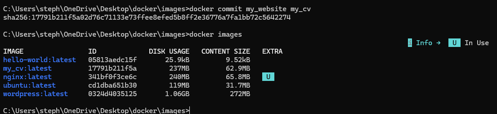

**Prerequisites:**
- html file to replace nginx html welcome page
- css file
- both files saved in a folder to access from 
- running nginx container

1- create a new nginx container, make sure to name it. Use the following command:
`docker run --name my_website -d -p 80:80 nginx`
- can be accessed in the local host browser (as running on port 80)
- navigate into correct folder (use cd and dir instead of ls)

2- enter the nginx container with the following command:
`docker exec -it my_website bash`
- it (interactive)
- add bash to specify what cli you want to use
- if successful, user will change to root
  
3- navigate to the nginx folder
  ```
  cd usr
  cd share
  cd nginx
  ```

4- navigate into the html folder and remove index.html - we want to replace this file with our own
```
cd html
rm index.html
```

5- exit out of the container using command `exit`

6- copy our own html file into the nginx container
`docker cp index.html my_website:usr/share/nginx/html/index.html`
my_website - container name
- must follow with the file path 
index.html - the name you want to give the file
- docker will inform you if the file has been successfully copied
- to double check, refresh localhost on the web browser
  
7- copy over the css file into the nginx container
`docker cp css.css my_website:usr/share/nginx/html/css.css`
- docker will inform you if the file has been successfully copied
- to double check, refresh localhost on the web browser


the static website is now running within the docker container
- if the container is stopped, will have to redo the entire process
- can create a new image containing nginx, and all the changes we've just made

**Saving images on docker:**
run the command `docker commit my_website my_cv` on the container where all your changes have been made
- my_website - name of the container you want to save an image from
- my_cv - the name of the image you are creating
- can run the command `docker images` to double check it has been successfully created 