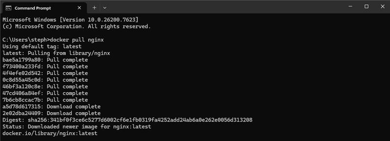

# DockerHub
- cloud based service for sharing docker container images
- acts as a version library, collaboration space, secure repo
- hosts public and private repos
- many official images provided by DockerHub and image providers

**Pulling images from DockerHub:**
- images are composed of layers
- to pull an image onto remote device (eg. nginx), run command `docker pull nginx` in CLI 
- running the command `docker images` will show the number of images downloaded on your local machine
- the image can then be run using the command `docker run -d nginx`
- nginx image will run continuously, as it is a web server
- although nginx is running, it must run on a port for us to view it on client machine

# Ports
osi model - open systems interconnnection model
- contains 7 layers:
  1- physical
  2- data link
  3- network - IP addresses
  4- transport - ports
  5- session
  6- presentation
  7- application

  port 80 - HTTP
  port 22 - SSH
  port 3000
  port 27107 - mongoDb

# Docker port mapping
- the host server isn't running nginx itself, so we cannot view it
- docker will be running the app within a container within a VM
- nginx will be running on port 80 by default within the docker container in the vm
- it is then mapped to an available host port within the container within the vm
- host port in container must be made available on host's network address and directly interact with the nginx container

**Mapping port 80 on nginx container to port 5000 on docker host vm:**
- can take place when creating an nginx container, using the following command:
  `docker run -d -p 5000:80 nginx`
-d parameter to run image in the background
-p parameter to map port 5000 from docker host vm to map to container port 80 (nginx automatically runs on port 80)

- to check the container has been mapped correctly, on web browser enter localhost:5000

- much quicker than when running on a virtual machine or on local machine

